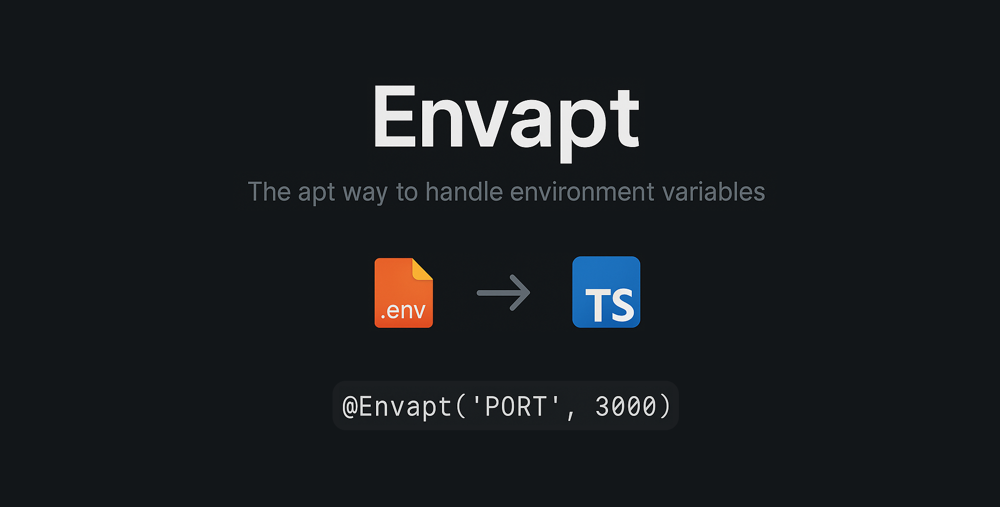

<p align="center">
  
</p>

<p align="center">
  A JavaScript/TypeScript environment configuration library that eliminates the boilerplate of transforming parsed <code>.env</code><br/>
  Get environment variables with correct runtime typing & fallbacks, template support, automatic, built-in, & custom transformations, and a tagged template resolver.<br/>
  <strong>No more <code>process.env.PORT || '3000'</code> everywhere!</strong>
</p>
<div align="center">
  <a href="https://www.npmjs.com/package/envapt"></a>
  <a href="https://jsr.io/@materwelon/envapt"></a>
  </a>
  <a href="https://codecov.io/github/materwelonDhruv/envapt"></a>
  <br>
  <a href="LICENSE"></a>
  <a href="https://www.typescriptlang.org/"></a>
  <a href="https://nodejs.org/api/esm.html"></a>
  <a href="https://nodejs.org/api/modules.html"></a>
  <a href="https://nodejs.org/"></a>
  <a href="https://bundlephobia.com/package/envapt"></a>
  <a href="https://www.npmjs.com/package/envapt"></a>
  <a href="https://github.com/materwelonDhruv/envapt/stargazers"></a>
</div>

---

## ✨ Features

- 🔧 **Automatic Type Detection** - Runtime types inferred from fallback values
- 🔗 **Template Variables** - `${VAR}` syntax with circular reference protection
- 🎯 **Class Properties** - Functional and Decorator-based configuration for class members _(Decorators: TypeScript only)_
- 🏷️ **Built-in & Custom Converters** - Ready-to-use converters for common patterns + custom transformations
- 🔖 **Tagged Template Resolver** - Tagged template literals with environment variable resolution
- 🌍 **Environment Detection** - Built-in development/staging/production handling
- 💪 **Edge Case Handling** - Robust validation and parsing for all scenarios
- 🛡️ **Type Safety** - Full TypeScript support with proper type inference _(TypeScript optional)_
- 📂 **Multiple .env Files** - Load from multiple sources
- ⚡ **Lightweight** - Minimal overhead with [`dotenv`](https://www.npmjs.com/package/dotenv) bundled

---

## Table of Contents

### ⚙️ Essentials

- [Requirements](#requirements)
- [Quick Start](#quick-start)
  - [Installation](#installation)
  - [Basic Usage](#basic-usage)

### 🧬 API Reference

- [API Reference](#api-reference)
  - [Decorator API](#decorator-api)
    - [Modern Syntax (Recommended)](#modern-syntax-recommended)
    - [Classic Syntax](#classic-syntax)
    - [Automatic Runtime Type Detection](#automatic-runtime-type-detection)
    - [Primitive Converters](#primitive-converters)
    - [Built-in Converters](#built-in-converters)
    - [Custom Array Converters](#custom-array-converters)
    - [Custom Converters](#custom-converters)
    - [Handling Missing Values](#handling-missing-values)
  - [Functional API](#functional-api)
  - [Tagged Template Resolver](#tagged-template-resolver)
  - [Converter Type Quick Reference](#converter-type-quick-reference)

### 🌍 Environment & Templates

- [Environment Detection](#environment-detection)
  - [Environment Management](#environment-management)
- [Template Variables](#template-variables)
  - [Circular Reference Protection](#circular-reference-protection)

### 🛠 Configuration & Errors

- [Configuration](#configuration)
  - [Multiple .env Files](#multiple-env-files)
  - [Dotenv Configuration](#dotenv-configuration)
- [Error Handling](#error-handling)
  - [Error Code Reference](#error-code-reference)

### 🚀 Examples

- [Advanced Examples](#advanced-examples)
  - [JavaScript](#javascript)
  - [TypeScript](#typescript)

<div align="right">

**[⬆️ Back to Top](#table-of-contents)**

</div>

---

## Requirements

### TypeScript Users Only

- **TypeScript**: `>=5.8` _(Only required for decorator API)_

```jsonc
// tsconfig.json (required settings for decorators)
{
  "experimentalDecorators": true,
  "module": "esnext", // or "nodenext"
  "moduleResolution": "bundler", // or "nodenext"
  "target": "ESNext",
  "lib": ["ESNext"]
}
```

> [!NOTE]
> **JavaScript users** can use all features except the `@Envapt` decorator API. The [Functional API](#functional-api), [Tagged Template Resolver](#tagged-template-resolver), and all converters work perfectly in plain JavaScript.

<div align="right">

**[⬆️ Back to Top](#table-of-contents)**

</div>

## Quick Start

### Installation

| Package Manager | Command                           |
| --------------- | --------------------------------- |
| **pnpm**        | `pnpm add envapt`                 |
| **yarn**        | `yarn add envapt`                 |
| **npm**         | `npm install envapt`              |
| **deno** (jsr)  | `deno add jsr:@materwelon/envapt` |
| **deno** (npm)  | `deno add npm:envapt`             |
| **bun**         | `bun add envapt`                  |

### Basic Usage

**Step 1:** Create a `.env` file:

```env
APP_PORT=8443
APP_URL=http://localhost:${APP_PORT}
DATABASE_URL=postgres://localhost:5432/mydb
IS_PRODUCTION=false
MAX_CONNECTIONS=100
ALLOWED_ORIGINS=https://app.com,https://admin.com
```

**JavaScript Example (Functional API):**

```js
import { Envapter, Converters } from 'envapt';

// Basic usage
const port = Envapter.getNumber('APP_PORT', 3000);
const url = Envapter.get('APP_URL', 'http://localhost:3000');
const isProduction = Envapter.isProduction;

console.log(`Server running on port ${port}`); // 8443
console.log(`URL: ${url}`); // "http://localhost:8443"

// Advanced converters
const corsOrigins = Envapter.getUsing('ALLOWED_ORIGINS', Converters.Array, []);
const dbConfig = Envapter.getUsing('DATABASE_CONFIG', Converters.Json, {});

// Tagged template literals
const message = Envapter.resolve`Server ${'APP_URL'} is ready!`;
console.log(message); // "Server http://localhost:8443 is ready!"
```

**TypeScript Example (Decorator API):**

```ts
import { Envapt, Envapter, Converters } from 'envapt';

// Global app configuration (static properties)
class AppConfig extends Envapter {
  @Envapt('APP_PORT', 3000)
  static readonly port: number;

  // The Classic Syntax only works for Primitive Converters. Converters.Url is a Built-in Converter.
  @Envapt('APP_URL', { fallback: new URL('http://localhost:3000'), converter: Converters.Url })
  static readonly url: URL;

  @Envapt('ALLOWED_ORIGINS', {
    fallback: ['http://localhost:3000'],
    converter: Converters.Array
  })
  static readonly allowedOrigins: string[];
}

// Service configuration (instance properties)
class DatabaseService {
  @Envapt('DATABASE_URL', 'sqlite://memory')
  declare readonly databaseUrl: string;

  // Will detect that '10' is a number and set the runtime type accordingly
  @Envapt('MAX_CONNECTIONS', 10)
  declare readonly maxConnections: number;

  @Envapt('REQUEST_TIMEOUT', { converter: Converters.Time, fallback: 5000 })
  declare readonly timeout: number; // Converts "5s" to 5000ms

  async connect() {
    console.log(`Connecting to ${this.databaseUrl}`);
    // Connection logic here
  }
}

// Usage
console.log(AppConfig.port); // 8443 (number)
console.log(AppConfig.url.href); // "http://localhost:8443"

const dbService = new DatabaseService();
await dbService.connect();
```

<div align="right">

**[⬆️ Back to Top](#table-of-contents)**

</div>

## API Reference

### Decorator API

> [!IMPORTANT]
> **TypeScript Only**: The `@Envapt` decorator API requires TypeScript with `experimentalDecorators: true`. JavaScript users should use the [Functional API](#functional-api) instead.

The `@Envapt` decorator can be used on both **static** and **instance** class properties:

- **Static properties**: Can use for global configuration that's shared across your entire application (e.g., app port, global features, environment settings)
- **Instance properties**: Can use for service-specific configuration that may vary per service or when you want the configuration tied to a specific class instance (e.g., database connections, service endpoints, per-service settings)

**Important**: Instance properties must be declared with `declare` keyword or `!` assertion since they're populated by the decorator rather than set in a constructor.

#### Modern Syntax (Recommended)

```ts
@Envapt('ENV_VAR', { fallback?: T, converter?: EnvConverter<T> })
```

> [!TIP]
> **Generic Typing for Better IntelliSense**
>
> You can specify explicit types using generics for better type safety and IntelliSense:
>
> ```ts
> // Explicit typing provides better IntelliSense for complex types
> @Envapt<DatabaseConfig>('DB_CONFIG', {
>   fallback: { host: 'localhost', port: 5432, ssl: false },
>   converter: Converters.Json
> })
> static readonly dbConfig: DatabaseConfig;
> ```

#### Classic Syntax

```ts
@Envapt('ENV_VAR', fallback?, converter?)
```

#### Automatic Runtime Type Detection

Types are automatically inferred from fallback values.

```ts
class Config extends Envapter {
  // Static properties for global settings
  @Envapt('APP_NAME', 'MyApp') // string
  static readonly appName: string;

  @Envapt('APP_PORT', 3000) // number
  static readonly port: number;

  @Envapt('DEBUG_MODE', false) // boolean
  static readonly debugMode: boolean;

  // Instance properties for service-specific settings
  @Envapt('SMTP_HOST', 'localhost') // string
  declare readonly smtpHost: string;

  @Envapt('SMTP_PORT', 587) // number
  declare readonly smtpPort: number;

  @Envapt('SMTP_SECURE', true) // boolean
  declare readonly smtpSecure: boolean;

  sendEmail(to: string, subject: string) {
    console.log(`Sending via ${this.smtpHost}:${this.smtpPort}`);
  }
}
```

#### Primitive Converters

Envapt allows using the 5 "primitive" type-like converters. These **will** coerce values.

> [!NOTE]
> The runtime validator will ignore this usage, allowing type coercion for flexibility.

**Valid Primitive Types:** `String`, `Number`, `Boolean`, `Symbol`, and `BigInt`.

```ts
class Config extends Envapter {
  @Envapt('PORT_STRING', { fallback: 'hello-world', converter: String })
  static readonly portAsString: string;

  @Envapt('DEBUG_FLAG', { fallback: true, converter: Boolean })
  static readonly debugMode: boolean;

  @Envapt('USER_ID', { fallback: 12345, converter: Number })
  static readonly userId: number;

  @Envapt('MAX_SAFE_INT', { fallback: 9007199254740991n, converter: BigInt })
  static readonly maxSafeInt: bigint;

  @Envapt('APP_INSTANCE', { fallback: Symbol(main), converter: Symbol })
  static readonly appInstance: symbol;

  // Instance properties work the same way
  @Envapt('CONNECTION_TIMEOUT', { fallback: 5000, converter: Number })
  declare readonly timeout: number;

  // Type coercion example
  @Envapt('PERMISSIONS', { fallback: '72394823472342983', converter: BigInt })
  declare readonly permissions: bigint; // Converts "72394823472342983" to BigInt
}
```

**When to use primitive converters:**

- When you need explicit type coercion between incompatible types
- When working with external systems that provide values in unexpected formats

#### Built-in Converters

Envapt provides many built-in converters for common patterns:

> [!IMPORTANT]
> **Use the `Converters` enum** instead of string literals. They look better, and provide better type inference:
>
> ```ts
> import { Converters } from 'envapt';
> // ✅ Recommended: Use enum
> @Envapt('PORT', { converter: Converters.Number, fallback: 3000 })
>
> // ❌ Discouraged: String literals (still supported for compatibility)
> @Envapt('PORT', { converter: 'number', fallback: 3000 })
> ```
>
> Built-in converters enforce **strict type validation** between the converter and fallback types. The converter's expected return type must match the fallback's type.

```ts
class Config extends Envapter {
  // Basic types
  @Envapt('APP_NAME', { converter: Converters.String, fallback: 'MyApp' })
  static readonly appName: string;

  @Envapt('PORT', { converter: Converters.Number, fallback: 3000 })
  static readonly port: number;

  @Envapt('PRODUCTION_MODE', { converter: Converters.Boolean, fallback: false })
  static readonly productionMode: boolean;

  // Advanced types
  @Envapt('CORS_ORIGINS', { converter: Converters.Array, fallback: [] })
  static readonly corsOrigins: string[];

  @Envapt('CONFIG_JSON', { converter: Converters.Json, fallback: {} })
  static readonly config: object;

  @Envapt('API_URL', { converter: Converters.Url, fallback: new URL('http://localhost') })
  static readonly apiUrl: URL;

  @Envapt('TIMEOUT', { converter: Converters.Time, fallback: 5000 })
  static readonly timeout: number; // Converts "30s" to 30000ms

  // Instance properties work the same way
  @Envapt('CACHE_TTL', { converter: Converters.Time, fallback: 3600000 })
  declare readonly cacheTtl: number; // "1h" becomes 3600000ms
}
```

> [!WARNING]
> These will throw runtime errors due to type mismatches:
>
> ```ts
> // ❌ String converter with number fallback
> @Envapt('VAR', { converter: Converters.String, fallback: 42 })
>
> // ❌ URL converter with string fallback
> @Envapt('VAR', { converter: Converters.Url, fallback: 'http://example.com' })
>
> // ✅ Use primitive constructors for type coercion instead
> @Envapt('VAR', { converter: String, fallback: 42 })
> ```

**Available Built-in Converters:**

| **Converter**        | **Alias**   | **Description**                                                      |
| -------------------- | ----------- | -------------------------------------------------------------------- |
| `Converters.String`  | `'string'`  | String values                                                        |
| `Converters.Number`  | `'number'`  | Numeric values (integers and floats)                                 |
| `Converters.Integer` | `'integer'` | Integer values only                                                  |
| `Converters.Float`   | `'float'`   | Float values only                                                    |
| `Converters.Boolean` | `'boolean'` | Boolean values (`true`/`false`, `yes`/`no`, `on`/`off`, `1`/`0`)     |
| `Converters.Bigint`  | `'bigint'`  | BigInt values for large integers                                     |
| `Converters.Symbol`  | `'symbol'`  | Symbol values (creates symbols from string descriptions)             |
| `Converters.Json`    | `'json'`    | JSON objects/arrays (safe parsing with fallback)                     |
| `Converters.Array`   | `'array'`   | Comma-separated string arrays                                        |
| `Converters.Url`     | `'url'`     | URL objects                                                          |
| `Converters.Regexp`  | `'regexp'`  | Regular expressions (supports `/pattern/flags` syntax)               |
| `Converters.Date`    | `'date'`    | Date objects (supports ISO strings and timestamps)                   |
| `Converters.Time`    | `'time'`    | Time values (e.g. `"5s"`, `"30m"`, `"2h"` converted to milliseconds) |

#### Custom Array Converters

For more control over array parsing:

> [!IMPORTANT]
> Array converters validate that:
>
> 1. **Fallback must be an array** (if provided)
> 2. **All fallback elements have consistent types** (no mixed types like `['string', 42, true]`)
> 3. **Array converter `type` matches fallback element types** (if `type` is specified)

```ts
class Config extends Envapter {
  // Basic array (comma-separated strings)
  @Envapt('TAGS', { converter: Converters.Array, fallback: [] })
  static readonly tags: string[];

  // Custom delimiter
  @Envapt('ALLOWED_METHODS', { converter: { delimiter: '|' }, fallback: ['GET'] })
  declare readonly allowedMethods: string[];

  // Custom delimiter with type conversion
  @Envapt('RATE_LIMITS', { converter: { delimiter: ',', type: Converters.Number }, fallback: [100] })
  declare readonly rateLimits: number[];

  @Envapt('FEATURE_FLAGS', { converter: { delimiter: ';', type: 'boolean' }, fallback: [false] })
  declare readonly featureFlags: boolean[];
}
```

> [!WARNING]
> These will throw runtime validation errors:
>
> ```ts
> // ❌ Mixed types in fallback array
> @Envapt('MIXED', { converter: Converters.Array, fallback: ['string', 42, true] })
>
> // ❌ Array converter type doesn't match fallback elements
> @Envapt('NUMS', { converter: { delimiter: ',', type: Converters.Number }, fallback: ['not', 'numbers'] })
>
> // ❌ Non-array fallback with array converter
> @Envapt('INVALID', { converter: Converters.Array, fallback: 'not-an-array' })
> ```

**ArrayConverter Interface:**

- `delimiter: string` - The string used to split array elements
- `type?: BuiltInConverter` - Optional type to convert each element to (excludes `Converters.Array`, `Converters.Json`, and `Converters.Regexp`)

#### Custom Converters

Transform environment values to any type:

```ts
class Config extends Envapter {
  @Envapt('TAGS', {
    fallback: new Set(['default']),
    converter: (raw, fallback) => {
      if (!raw) return fallback;
      return new Set(raw.split(',').map((s) => s.trim()));
    }
  })
  static readonly tags: Set<string>;

  @Envapt('NOTIFICATION_CHANNELS', {
    fallback: new Map([['email', 'enabled']]),
    converter: (raw, fallback) => {
      if (!raw) return fallback;
      const map = new Map();
      raw.split(',').forEach((pair) => {
        const [key, value] = pair.split(':');
        map.set(key?.trim(), value?.trim() || 'enabled');
      });
      return map;
    }
  })
  declare readonly channels: Map<string, string>;
}
```

> [!TIP]
> **Custom Validation with Error Throwing**
>
> Custom converters can throw errors for validation. The custom converter is called even when a variable is not found in the env file(s):
>
> ```ts
> @Envapt<string>('API_KEY', {
>   converter(raw, _fallback) {
>     if (typeof raw !== 'string' || raw === '') {
>       throw new Error('API_KEY is required and cannot be empty');
>     }
>     return raw;
>   }
> })
> static readonly apiKey: string;
> ```
>
> _No `fallback` needed here because the converter throws an error if a value is not what we want it to be_

#### Handling Missing Values

Control what happens when environment variables don't exist:

```ts
class Config extends Envapter {
  // Returns undefined if not found
  @Envapt('OPTIONAL_FEATURE', { fallback: undefined })
  static readonly optionalFeature: string | undefined;

  // Returns null if not found (no fallback provided)
  @Envapt('MISSING_CONFIG', { converter: Converters.String })
  static readonly missingConfig: string | null;

  // Uses fallback if not found
  @Envapt('DEFAULT_THEME', { fallback: 'light' })
  static readonly defaultTheme: string;

  // Instance properties work the same way
  @Envapt('LOG_FILE_PATH', { fallback: undefined })
  declare readonly logFilePath: string | undefined;
}
```

### Functional API

For functional-style environment variable access on primitive types:

```js
import { Envapter, Converters } from 'envapt';

// Basic type-specific getters
const str = Envapter.get('STRING_VAR', 'default');
const num = Envapter.getNumber('NUMBER_VAR', 42);
const bool = Envapter.getBoolean('BOOLEAN_VAR', false);
const bigint = Envapter.getBigInt('BIGINT_VAR', 100n);
const symbol = Envapter.getSymbol('SYMBOL_VAR', Symbol('default'));

// Advanced converter methods
const jsonData = Envapter.getUsing('CONFIG_JSON', Converters.Json);
const urlArray = Envapter.getUsing('API_URLS', { delimiter: ',', type: Converters.Url });
const customData = Envapter.getWith('RAW_DATA', (raw) => raw?.split('|').map((s) => s.trim()));

// Instance methods (same API available)
const envapter = new Envapter();
const value = envapter.get('VAR', 'default');
const processed = envapter.getUsing('DATA', Converters.Array);
```

For functional-style environment variable access with converters:

```js
import { Envapter, Converters } from 'envapt';

// Use built-in converters directly
const config = Envapter.getUsing('API_CONFIG', Converters.Json, { default: 'value' });
const urls = Envapter.getUsing('SERVICE_URLS', { delimiter: '|', type: Converters.Url });

// TypeScript: Use type override for better type inference
const typedConfig = Envapter.getUsing<{ host: string; port: number; ssl: boolean }>('DATABASE_CONFIG', Converters.Json);
// typedConfig is now typed as { host: string; port: number; ssl: boolean } instead of JsonValue | undefined

// Use custom converter functions
const processedData = Envapter.getWith(
  'RAW_DATA',
  (raw, fallback) => {
    if (!raw) return fallback ?? [];
    return raw.split(',').map((item) => ({ name: item.trim(), enabled: true }));
  },
  []
);

// Instance methods work the same way
const envapter = new Envapter();
const result = envapter.getUsing('DATABASE_CONFIG', Converters.Json);
```

> [!TIP]
> **Type Override with `getUsing`**
>
> You can explicitly specify the return type for `getUsing` when TypeScript's inference isn't specific enough (especially useful with `Converters.Json`):
>
> ```ts
> // Default behavior
> const config = Envapter.getUsing('CONFIG', Converters.Json); // type: JsonValue | undefined (undefined because no fallback)
>
> // Override with specific interface
> interface DatabaseConfig {
>   host: string;
>   port: number;
>   ssl: boolean;
> }
> const dbConfig = Envapter.getUsing<DatabaseConfig>('DB_CONFIG', Converters.Json);
> // dbConfig is now properly typed as DatabaseConfig
> ```
>
> _Make sure the fallback value matches the expected type, if you use a fallback. Otherwise you'll see a TypeScript error._\
> _This does NOT validate the type at runtime. You'll need to handle that yourself._

### Converter Type Quick Reference

| **Use Case**            | **Converter Type**        | **Example**                                               |
| ----------------------- | ------------------------- | --------------------------------------------------------- |
| **Type coercion**       | Primitive constructors    | `converter: String`                                       |
| **Strict validation**   | Built-in converters       | `converter: Converters.String`                            |
| **Array parsing**       | Built-in Array converters | `converter: { delimiter: ',', type?: Converters.String }` |
| **Complex transforms**  | Custom function           | `converter: (raw, fallback) => ...`                       |
| **Functional built-in** | `getUsing()` method       | `Envapter.getUsing('VAR', Converters.Json)`               |
| **Type override**       | `getUsing<T>()` method    | `Envapter.getUsing<MyType>('VAR', Converters.Json)`       |
| **Functional custom**   | `getWith()` method        | `Envapter.getWith('VAR', (raw) => transform(raw))`        |

> [!TIP]
> **Use the `Converters` enum**. They look better. Start with built-in converters, use primitive constructors when you need coercion, and custom converters for complex transforms.

### Tagged Template Resolver

Envapt provides a convenient tagged template literal syntax for resolving environment variables directly in template strings:

```js
import { Envapter } from 'envapt';

// Given these environment variables:
// API_HOST=api.example.com
// API_PORT=8080
// API_URL=https://${API_HOST}:${API_PORT}
// SERVICE_NAME=UserService

// Use tagged template literals for string interpolation
const endpoint = Envapter.resolve`Connecting to ${'SERVICE_NAME'} at ${'API_URL'}`;
// Returns: "Connecting to UserService at https://api.example.com:8080"

const logMessage = Envapter.resolve`Starting ${'SERVICE_NAME'} on port ${'API_PORT'}`;
// Returns: "Starting UserService on port 8080"

// Works with instance methods too
const envapter = new Envapter();
const status = envapter.resolve`${'SERVICE_NAME'} is running`;
// Returns: "UserService is running"
```

Works seamlessly with template variables in your `.env` file:

```env
# Your .env file
API_HOST=api.example.com
API_PORT=8080
API_URL=https://${API_HOST}:${API_PORT}  # Template resolved first
SERVICE_NAME=UserService
```

```ts
const message = Envapter.resolve`Service ${'SERVICE_NAME'} endpoint: ${'API_URL'}`;
// Returns: "Service UserService endpoint: https://api.example.com:8080"
```

> [!NOTE]
> Tagged template literals work with any environment variables, including those that use `${VAR}` template syntax in your `.env` file. The template resolution happens first, then the tagged template interpolation.

<div align="right">

**[⬆️ Back to Top](#table-of-contents)**

</div>

## Environment Detection

Envapt automatically detects your environment from these variables (in order):

1. `ENVIRONMENT`
2. `ENV`
3. `NODE_ENV`

Supported values: `development`, `staging`, `production` (case-sensitive)

### Environment Management

```js
import { Envapter, EnvaptEnvironment } from 'envapt';

// Check current environment
console.log(Envapter.environment); // Environment.Development (default)
console.log(Envapter.isProduction); // false
console.log(Envapter.isDevelopment); // true
console.log(Envapter.isStaging); // false

// Set environment
Envapter.environment = EnvaptEnvironment.Production;
Envapter.environment = 'staging'; // string also works
```

<div align="right">

**[⬆️ Back to Top](#table-of-contents)**

</div>

## Configuration

### Multiple .env Files

```js
import { resolve } from 'node:path';
import { Envapter } from 'envapt';

// Load from multiple files
Envapter.envPaths = [resolve(import.meta.dirname, '.env.local'), resolve(import.meta.dirname, '.env.production')];

// Or single file
Envapter.envPaths = resolve(import.meta.dirname, '.env.production');

// Or just don't set a path for it to default to .env at the root of your project

// Also, in CommonJS, use `__dirname` instead of `import.meta.dirname`:
```

### Dotenv Configuration

Envapt allows you to customize dotenv behavior by setting configuration options:

```js
import { Envapter } from 'envapt';

// Set dotenv configuration options
Envapter.dotenvConfig = {
  encoding: 'latin1', // File encoding (default: 'utf8')
  debug: true, // Enable debug logging
  override: true, // Override existing environment variables
  quiet: false, // Suppress non-error output (default: true)
  DOTENV_KEY: 'key...' // Decryption key for .env.vault files
};

// Get current configuration
console.log(Envapter.dotenvConfig);
```

> [!NOTE]
> The `path` and `processEnv` options are managed internally by Envapter and cannot be set via `dotenvConfig`.

<div align="right">

**[⬆️ Back to Top](#table-of-contents)**

</div>

## Template Variables

Envapt supports variable interpolation with `${VARIABLE}` syntax:

```env
DATABASE_HOST=localhost
DATABASE_PORT=5432
DATABASE_URL=postgres://${DATABASE_HOST}:${DATABASE_PORT}/mydb

API_VERSION=v1
API_BASE=https://api.example.com
API_ENDPOINT=${API_BASE}/${API_VERSION}/users
```

### Circular Reference Protection

```env
CIRCULAR_A=${CIRCULAR_B}
CIRCULAR_B=${CIRCULAR_A}
```

Circular references are detected and preserved as-is rather than causing infinite loops.

<div align="right">

**[⬆️ Back to Top](#table-of-contents)**

</div>

## Error Handling

Envapt provides detailed error codes for better debugging and error handling:

```js
import { EnvaptError, EnvaptErrorCodes } from 'envapt';

try {
  // This will throw an error for invalid configuration
  Envapter.dotenvConfig = { path: '.env.custom' };
} catch (error) {
  if (error instanceof EnvaptError) {
    console.log('Error code:', error.code);
    console.log('Error message:', error.message);

    // Handle specific error types
    switch (error.code) {
      case EnvaptErrorCodes.InvalidUserDefinedConfig:
        console.log('Invalid configuration provided');
        break;
      case EnvaptErrorCodes.EnvFileNotFound:
        console.log('Environment file not found');
        break;
      default:
        console.warn('Unhandled error code:', error.code);
        break;
    }
  }
}
```

### Error Code Reference

#### 🔧 Fallback Errors (1xx)

| **Error Code**                           | **Description**                                           |
| ---------------------------------------- | --------------------------------------------------------- |
| `InvalidFallback` (101)                  | Invalid fallback value provided                           |
| `InvalidFallbackType` (102)              | Fallback value type doesn't match expected converter type |
| `ArrayFallbackElementTypeMismatch` (103) | Array fallback contains elements of wrong type            |
| `FallbackConverterTypeMismatch` (104)    | Fallback type doesn't match the specified converter       |

#### 🧪 Converter Errors (2xx)

| **Error Code**                    | **Description**                                |
| --------------------------------- | ---------------------------------------------- |
| `InvalidArrayConverterType` (201) | Invalid array converter configuration provided |
| `InvalidBuiltInConverter` (202)   | Invalid built-in converter specified           |
| `InvalidCustomConverter` (203)    | Custom converter function is invalid           |
| `InvalidConverterType` (204)      | Converter type is not recognized               |
| `PrimitiveCoercionFailed` (205)   | Primitive type coercion failed                 |

#### 📂 Environment File & Config Errors (3xx)

| **Error Code**                   | **Description**                                |
| -------------------------------- | ---------------------------------------------- |
| `MissingDelimiter` (301)         | Delimiter is missing in array converter config |
| `InvalidUserDefinedConfig` (302) | Invalid user-defined configuration provided    |
| `EnvFilesNotFound` (303)         | Specified environment file doesn't exist       |

<div align="right">

**[⬆️ Back to Top](#table-of-contents)**

</div>

## Advanced Examples

### JavaScript

```js
import { Envapter, Converters } from 'envapt';

// Global configuration
const config = {
  port: Envapter.getNumber('PORT', 3000),
  requestTimeout: Envapter.getUsing('REQUEST_TIMEOUT', Converters.Time, 10000), // "5s" -> 5000ms
  featureFlags: Envapter.getWith(
    'FEATURE_FLAGS',
    (raw, fallback) => {
      if (!raw) return fallback;
      return new Set(raw.split(',').map((s) => s.trim()));
    },
    new Set(['basic'])
  )
};

// Service configuration
class DatabaseService {
  constructor() {
    this.databaseUrl = Envapter.get('DB_URL', 'sqlite://memory');
    this.cacheTtl = Envapter.getUsing('CACHE_TTL', Converters.Time, 3600000); // "1h" -> 3600000ms
    this.redisUrls = Envapter.getWith(
      'REDIS_URLS',
      (raw, fallback) => (raw ? raw.split(',').map((s) => new URL(s)) : fallback),
      [new URL('redis://localhost:6379')]
    );
  }

  async initialize() {
    console.log(`App running on port ${config.port}`);
    console.log(`Database: ${this.databaseUrl}`);
    console.log(`Cache TTL: ${this.cacheTtl}ms`);
  }
}
```

### TypeScript

```ts
import { Envapt, Envapter, Converters } from 'envapt';

class AppConfig extends Envapter {
  // Global settings (static)
  @Envapt('PORT', 3000)
  static readonly port: number;

  @Envapt('REQUEST_TIMEOUT', { converter: Converters.Time, fallback: 10000 })
  static readonly requestTimeout: number; // "5s" -> 5000ms (if env is set to "5s")

  @Envapt('FEATURE_FLAGS', {
    fallback: new Set(['basic']),
    converter: (raw, fallback) => {
      if (!raw) return fallback;
      return new Set(raw.split(',').map((s) => s.trim()));
    }
  })
  static readonly featureFlags: Set<string>;

  // Service settings (instance)
  @Envapt('DB_URL', 'sqlite://memory')
  declare readonly databaseUrl: string;

  @Envapt('CACHE_TTL', { converter: Converters.Time, fallback: 3600000 })
  declare readonly cacheTtl: number; // "1h" -> 3600000ms

  @Envapt('REDIS_URLS', {
    fallback: [new URL('redis://localhost:6379')],
    converter: (raw, fallback) => (raw ? raw.split(',').map((s) => new URL(s)) : fallback)
  })
  declare readonly redisUrls: URL[];

  async initialize() {
    console.log(`App running on port ${AppConfig.port}`);
    console.log(`Database: ${this.databaseUrl}`);
    console.log(`Cache TTL: ${this.cacheTtl}ms`);
  }
}
```

<div align="right">

**[⬆️ Back to Top](#table-of-contents)**

</div>

---

<hr/>

<p align="center">
  <a href="https://github.com/materwelondhruv/envapt">⭐️ Star it on GitHub</a> •
  <a href="https://github.com/materwelondhruv/envapt/issues">🐛 Report a bug</a> •
  <a href="https://github.com/materwelondhruv/envapt/issues/new?labels=enhancement">💡 Request a feature</a>
</p>

<p align="center">
  <sub>
    Built by <a href="https://github.com/materwelondhruv">@materwelonDhruv</a> • Licensed under
    <a href="LICENSE">Apache 2.0</a>
  </sub>
</p>
